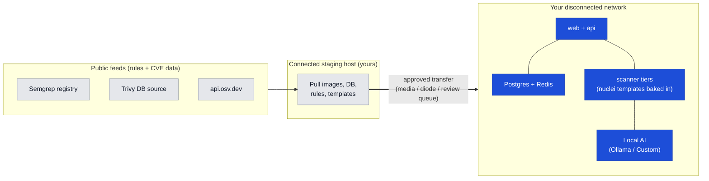

BreachLens is designed to run inside your own perimeter, and for most
regulated buyers that is the whole point: **your source code, your
findings, and your AI inference never leave your network, and nothing
phones home.**

A *fully disconnected* network — one with no outbound route at all —
needs one more thing: you provision offline mirrors for the scanner
rules and vulnerability data that a few scanners normally fetch at scan
time. That work is yours to do, and this page is honest about where it
is turnkey and where it is not.

<Warning>
  BreachLens is **not** "fully air-gapped out of the box." Several
  scanners fetch rules or CVE data at scan time (detailed below). In a
  network with zero egress you must mirror those feeds yourself, or
  accept the specific, documented degradations. Read the per-scanner
  table before you commit to a fully disconnected topology.
</Warning>

## What "inside your perimeter" already gives you

Even before you think about mirrors, a standard in-perimeter deployment
gives you real data residency:

<CardGroup cols={2}>
  <Card title="Your code stays local" icon="lock">
    Repositories are cloned into the scanner and analyzed in place.
    Scanning happens on your infrastructure. Source is not shipped to
    a BreachLens service.
  </Card>
  <Card title="Your findings stay local" icon="database">
    Findings, evidence, attack-path correlation, and reports live in
    your own Postgres. Correlation is pure local computation — no
    external dependency.
  </Card>
  <Card title="AI inference can stay local" icon="server">
    Point the AI layer at a local **Ollama** or an on-prem
    OpenAI-compatible endpoint (**Custom**) and prompts — including
    finding and code context — never leave your network.
  </Card>
  <Card title="No telemetry" icon="shield-halved">
    BreachLens does not send usage analytics to a vendor. Release notes
    are operator-pulled, not pushed. There is no call-home channel that
    carries your data out.
  </Card>
</CardGroup>

<Note>
  In this standard deployment, the only outbound traffic is a small set
  of public feeds a few scanners use to fetch **rules and CVE data**
  (see the table below). Those requests carry lookup metadata — rule
  requests, CVE IDs, package coordinates — **not** your source code and
  **not** your findings. Licensing is verified locally at API startup,
  without a license-server round trip.
</Note>

## What a fully disconnected network additionally requires

Some scanners fetch data at scan time. In a network with outbound
access those fetches just work; in a fully disconnected network you
mirror them, or accept the degradation. Here is the ground truth,
per scanner.

| Scanner | What it fetches online | How to mirror it offline |
|---|---|---|
| **SAST — Semgrep** | Rules, resolved via `--config auto` against the Semgrep registry, at scan time. | As shipped, the SAST scanner invokes `semgrep --config auto`, which contacts the Semgrep registry to resolve its ruleset. In a zero-egress network that resolution cannot complete. There is **no operator-facing switch today** to point Semgrep at a local rules directory — so you must keep the registry reachable through an internal proxy/mirror, or treat SAST as a known gap in a fully disconnected topology. See the uncertainty note below. |
| **SCA reachability — OSV** | `api.osv.dev`, per finding (results cached on disk within a scan). | Best-effort by design. With no route to osv.dev, reachability lookups fail closed to `UNKNOWN` and **the scan still completes with every CVE surfaced** — you lose only the "is the vulnerable function reachable" tag, never the finding. Pre-seeding the on-disk cache is not a verified operator lever today (the cache directory is fixed in code). |
| **SCA / Container CVE data — Trivy** | Its vulnerability database at scan time. The Trivy **binary** ships in the image; the **DB does not**. | Use Trivy's own offline mechanisms: pre-download the DB on a connected host, and point the scanner container at an internal OCI mirror. These are Trivy-native env vars, set on the scanner container — verify them against the shipped Trivy version. |
| **DAST / Pentest — Nuclei** | Templates. **These ship baked into the scanner image at build time.** | Runs offline as-is — no scan-time template fetch is required for the DAST/pentest tier to work. To *refresh* the corpus, rebuild the scanner image on a connected host (or mirror the templates into a rebuild) and load the new image in. |

<Note>
  Other scanners' detection data is compiled into the image and runs
  offline: **Secrets (TruffleHog)** detectors and **IaC (Checkov)**
  policies ship inside the scanner and need no scan-time fetch for
  detection. If your TruffleHog configuration enables *live secret
  verification*, that step makes outbound calls — keep it off in a
  disconnected network. Container image **signature** verification
  (cosign) is a separate concern: keyless verification depends on
  public Sigstore infrastructure, so verify against operator-provided
  public keys rather than keyless in a disconnected network. Container
  CVE, secret, and misconfiguration scanning itself does not depend on
  cosign.
</Note>

### The Trivy offline pattern

Trivy reads these from its own environment; set them on the scanner
container.

```bash
# On a connected staging host, pre-fetch the DB:
trivy image --download-db-only

# Point the scanner at your internal OCI mirror:
TRIVY_DB_REPOSITORY=registry.internal/trivy-db
```

Transfer the downloaded DB and the mirror into your network with the
rest of your bundle (next section), then boot the scanner with the env
var set. This is Trivy's documented mechanism, not a BreachLens-specific
wiring — confirm it against your image's Trivy version before you rely
on it in production.

## The customer-pulls, vendor-never-pushes model

Disconnected deployment follows one rule: **you pull, on your schedule;
the vendor never pushes into your network.** There is no BreachLens
service that reaches into your environment to update anything.



The shape of the workflow is:

<Steps>
  <Step title="Pull on a connected host">
    On one internet-connected staging host, pull the BreachLens images,
    the Trivy DB, any Semgrep rules you mirror, and (if refreshing)
    nuclei templates. Verify image signatures there.
  </Step>
  <Step title="Transfer through your approved path">
    Move the bundle across your boundary however policy mandates —
    physical media, a data diode, or a manual review queue. It is just
    files.
  </Step>
  <Step title="Load inside the perimeter">
    Load the images and place the mirrored feeds where the scanner
    reads them. Boot the stack. Refresh on whatever cadence your policy
    allows.
  </Step>
</Steps>

<Warning>
  BreachLens does not ship a verified one-command "air-gap bundle"
  builder in this repository. The pull → transfer → load workflow above
  is the model; assembling the mirror set is an **operator task** using
  each tool's native mechanism (`trivy image --download-db-only`,
  `docker save`/`docker load`, your registry mirror). Treat any
  single-script "airgap bundle" you see referenced internally as
  unverified until you confirm it exists for your release.
</Warning>

## What happens with no AI provider — and invitations without email

### AI is additive, not required

BreachLens ships **no** default API key. AI features stay off until an
operator configures a provider in **Settings → AI Providers**. With no
provider configured:

- **Off:** false-positive triage, attack-path summaries, remediation
  drafting, the **Ask** assistant, and the four LLM-judged MCP probes.
- **On, unchanged:** every rule-based and tool-based scanner — SAST,
  SCA, secrets, IaC, container, DAST, pentest — plus attack-path
  correlation and the five deterministic MCP heuristic probes. Detection
  does not depend on AI.

For a disconnected network that still wants the AI layer, run it locally:
point **Ollama** or a **Custom** on-prem OpenAI-compatible endpoint
(for example vLLM) at BreachLens, and inference stays inside your
perimeter.

### Onboarding needs no email egress

You do not need an outbound SMTP path to add teammates. Invitations use
a **copy-link token**: BreachLens generates an invite whose token is the
bearer of authority, you hand the recipient the link over whatever
internal channel you use, and they accept it against the platform
directly. No email has to leave your network for onboarding to work.

<Tip>
  Pair local AI (Ollama / Custom) with an internal SSO IdP (Keycloak,
  ADFS, on-prem Okta/Entra) and copy-link invitations, and the entire
  operator lifecycle — sign-in, onboarding, triage, auto-fix drafting —
  runs without a single outbound connection to a vendor.
</Tip>

## Next steps

<CardGroup cols={2}>
  <Card title="Deployment architecture" icon="sitemap" href="/deployment/architecture">
    The services, ports, volumes, and network boundaries — the map you
    build your firewall rules against.
  </Card>
  <Card title="AI providers (bring your own)" icon="sparkles" href="/ai-providers">
    Configure Ollama or a Custom on-prem endpoint so AI features run
    fully inside your network.
  </Card>
</CardGroup>
