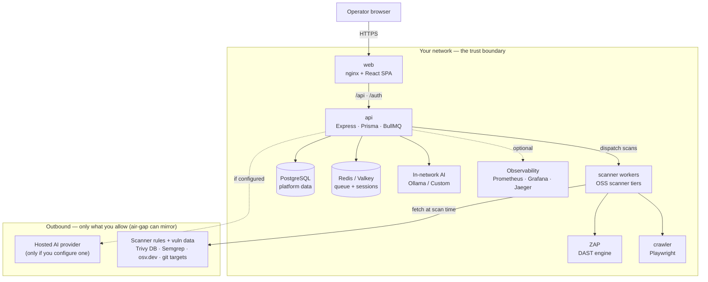

BreachLens is delivered as a set of containers you run inside your own
network. There is no BreachLens-hosted control plane in the loop: your
source code, your scan findings, and — when you choose an in-network
model — your AI inference all stay on infrastructure you own. This page
is the topology a security reviewer needs to sign off a self-hosted
install: what runs where, what talks to what, and exactly what crosses
the boundary of your network.

<Note>
  **Data residency is the default.** The datastore never touches the
  internet, and the platform ships with **no** AI key and **no** phone-home.
  The only outbound calls are the ones listed in
  [What crosses the boundary](#what-crosses-the-boundary) — the AI provider
  *you* configure, and the scanner rule/vulnerability-data sources — both of
  which an air-gapped install can mirror. See
  [Air-gap installation](/deployment/air-gap) for the disconnected path.
</Note>

## Topology at a glance

The browser only ever talks to **web**. Everything else is reached
through it — **web** reverse-proxies `/api` and `/auth` to **api**, and
**api** is the single control plane that owns the database, the job
queue, scan dispatch, and AI routing. The datastores sit behind **api**
and have no path to the internet.

## Services

Ports below are the container/service ports. In a single-node
Compose install only **web** (and, if you want direct API access, **api**)
is published to the host; the datastores are never exposed. In Kubernetes
nothing is published at all — reachability comes from an outbound tunnel.

| Service | Role | Port | Data it holds |
|---|---|---|---|
| **web** | nginx serving the React SPA; reverse-proxies `/api` + `/auth` to api | 80 (Compose) · 443 (K8s, TLS) | None — stateless |
| **api** | Express + Prisma + BullMQ control plane: auth, RBAC, scan orchestration, correlation, AI routing | 3000 | None at rest — reads/writes Postgres + Redis |
| **scanner** | FastAPI worker running the code/cloud scanner tiers (SAST, SCA, secrets, IaC, container, DAST) | 8000 | Ephemeral per-scan workspaces |
| **scanner-pentest** *(opt-in)* | Autonomous pentest tier (nuclei, nikto, sqlmap, dalfox, and OWASP-expansion modules) | 8000 | Ephemeral per-scan workspaces |
| **scanner-cspm** *(opt-in)* | Cloud posture (Prowler) for AWS / Azure / GCP | 8000 | Ephemeral; cloud credentials passed per scan |
| **zap** | OWASP ZAP daemon driving the DAST spider + active scan | 8080 (host `127.0.0.1:8090` for recording) | In-memory proxy/session state |
| **crawler** | Playwright/Chromium SPA crawler feeding DAST + pentest URL discovery | 8001 | Ephemeral |
| **PostgreSQL** | Primary datastore — orgs, users, assets, findings, attack paths, configs | 5432 | All platform data; provider credentials encrypted at rest |
| **Redis / Valkey** | BullMQ job queue + session store | 6379 | Job state + sessions (ephemeral, LRU eviction) |
| **backup** *(opt-in)* | Daily `pg_dump`, optional AES-256-GCM encryption, retention pruning | — | Database backups (dedicated volume) |
| **ollama** *(opt-in)* | Local LLM inference for AI features — fully in-network | 11434 | Downloaded model weights |
| **Observability** *(opt-in)* | Prometheus / Grafana / Jaeger / cAdvisor — metrics + traces | 9090 / 3001 / 16686 / 8089 | Metrics TSDB, dashboards, traces |
| **cloudflared** *(opt-in)* | Outbound-only Cloudflare tunnel for public reachability without open ports | — | None |

<Note>
  Provider API keys are **not** stored in a static config file — they live
  per-organization in Postgres, encrypted with your `ENCRYPTION_KEY`, and the
  config only ever reports `hasCredentials: true`. See
  [AI providers](/ai-providers) for how routing works.
</Note>

## Where your data lives

The compose stack splits traffic across two networks, and that split
**is** the trust boundary:

- **`internal`** — a Docker network created with `internal: true`, which
  means it has **no route to the internet at all**. PostgreSQL and Redis
  live here and nowhere else. Nothing in your database can be reached
  from outside, and nothing in your database can reach out.
- **`public`** — the only network with outbound access. The application
  and scanner tier (**api**, **scanner**, **zap**, **crawler**, and an
  optional **ollama**) attach here so they can clone the repos you point
  them at, fetch scanner data, and reach the AI provider you configure.

So every byte of platform data — code, findings, attack paths, secrets —
stays on the datastore, which is structurally cut off from the internet.
The app tier is the only thing that ever egresses, and only for the
specific, enumerable reasons below.

## What crosses the boundary

These are the *only* outbound destinations, why they exist, and how a
disconnected deployment replaces each with an in-network mirror.

| Destination | Service | Why | In-network / mirror |
|---|---|---|---|
| Your configured **AI provider** | api | FP triage, attack-path summaries, remediation drafts — **only if you configure one; no default key ships** | Run **Ollama** or a **Custom** OpenAI-compatible endpoint in your cluster → zero external AI egress |
| **Trivy** vulnerability DB | scanner | Container + dependency CVE data, fetched at scan time | Mirror the Trivy DB and point Trivy at your mirror |
| **Semgrep** registry rules (`--config auto`) | scanner | SAST rule packs pulled at scan time | Vendor a pinned ruleset served from inside your network |
| **api.osv.dev** | scanner | SCA advisory / reachability lookups | Mirror the OSV data set |
| **Target git repos** + GitHub API | api / scanner | Clone the code you asked it to scan; PR checks + auto-fix PRs | Point at an in-network GitHub Enterprise Server / GitLab |
| **interactsh** (`oast.fun`) | scanner-pentest | Out-of-band callback detection for blind vulns | Self-host interactsh and set `INTERACTSH_URL` |
| **Cloudflare** edge | cloudflared | Public reachability — **only if you enable the tunnel** | Omit the tunnel; front the stack with your own ingress |

<Note>
  **Nuclei templates are baked into the scanner image** — they are shipped
  in the build, not downloaded at scan time, so that rule set needs no
  outbound access.
</Note>

<Warning>
  **A fully disconnected install is not the out-of-the-box default.** By
  default the scanner reaches out for the Trivy DB, Semgrep rules, and
  `osv.dev` at scan time. For an air-gapped deployment you must provision
  offline mirrors for those sources (and choose an in-network AI provider)
  before cutting the link — the platform does not carry them for you. The
  [Air-gap installation](/deployment/air-gap) guide walks through it.
</Warning>

## Persistence and backups

State lives in a small number of named volumes, so a container restart
is never a data-loss event:

- **Postgres data** — the system of record.
- **Redis data** — queue + session state (safe to lose; jobs re-derive).
- **Backups** — the opt-in `backup` service writes a daily custom-format
  `pg_dump` (optionally AES-256-GCM encrypted) and prunes to a retention
  count. **api** mounts that volume read-only to render the backup-health
  panel under **Settings → Operations**.
- **Model weights** — only present when you run the in-network Ollama
  provider.

In Kubernetes the datastores are typically an external managed service
(with the provider's own backup mechanism) rather than in-cluster
containers — see below.

## Internal TLS

Traffic between services can be encrypted, and the posture differs by
deployment:

- **Single-node (Compose)** — an opt-in overlay encrypts the data
  persistence layer and the app tier: Postgres accepts SSL-only
  connections, Redis is TLS-only, and **api**, **scanner**, and **web**
  serve HTTPS. This is **server-authenticated TLS**, not a full
  service-to-service mesh — full mutual-TLS across every internal hop is
  a customer-triggered upgrade, not the default.
- **Kubernetes** — the reference manifests run **TLS at every internal
  hop** (browser→edge, edge→web, web→api, api→scanner, api→managed
  datastores) using an internal CA with per-service certificates.

<Note>
  With the default self-signed / internal-CA certificates, browsers show a
  "not trusted" warning until an operator accepts the cert or installs the
  internal CA. That is expected for a private deployment — see the
  [Quickstart](/quickstart) cert-acceptance step.
</Note>

## Single-node (Compose) vs production (Kubernetes)

The same images run in both shapes. What changes is who owns the
datastores, how the platform is reached, and how egress is enforced.

| | Single-node (Docker Compose) | Production (Kubernetes) |
|---|---|---|
| **Orchestration** | `docker compose up` on one host | Deployments + Services + a migrate Job, delivered GitOps-style via Argo CD |
| **Postgres / Redis** | Containers with named volumes | External **managed** Postgres + Redis/Valkey in a private VPC (or your own), reached over TLS |
| **Public access** | Host port, or the outbound Cloudflare tunnel | **No public LoadBalancer and no public IP** — an outbound Cloudflare Zero Trust tunnel plus an Access allow-list |
| **Internal TLS** | Opt-in data-layer + app-tier TLS overlay | TLS at every internal hop via internal-CA per-service certs |
| **Secrets** | `.env` file | Kubernetes Secrets, backed by an external secrets manager (ESO / Vault) |
| **Egress control** | Docker `internal` / `public` network split | NetworkPolicy (Cilium), including a block on the cloud metadata endpoint (`169.254.169.254`) for the scanner pods |
| **Scaling** | Single host | **api** / **web** / **scanner** as independent Deployments; the scanner uses a Recreate strategy because it holds in-memory job state |

<Note>
  The Kubernetes manifests in the repo describe a specific reference profile
  (managed DigitalOcean datastores, a Cloudflare tunnel, and Vault-backed
  secrets). Treat them as the **production topology reference** — a customer
  cluster substitutes its own managed datastores, ingress, and secrets
  backend. The primary supported install path remains single-node Compose;
  see the [Quickstart](/quickstart).
</Note>

## Next steps

<CardGroup cols={2}>
  <Card title="Air-gap installation" icon="shield-halved" href="/deployment/air-gap">
    Run fully disconnected — provision offline mirrors for the scanner
    rules and vulnerability data, and keep AI inference in-network.
  </Card>
  <Card title="Licensing" icon="key" href="/deployment/licensing">
    How the license is issued and verified at startup, and what it
    gates.
  </Card>
</CardGroup>
