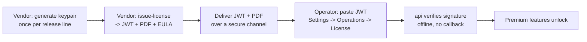

BreachLens is licensed with a signed **license key** — a JWT your BreachLens
contact hands you. The api verifies it **offline** using an embedded public
key: no phone-home, no outbound call, so it works behind an air-gap. This page
covers the three things you'll actually do with a license — **apply** one
(operator), understand **what the runtime check does**, and **issue** one
(vendor / reseller).

<Note>
  Applying a license is a one-time, self-service step. You paste the key you
  were sent; nothing is generated on your side. Issuing keys is a
  vendor-only workflow and is covered last.
</Note>

## License lifecycle at a glance



The private signing key never leaves the vendor. The **public** key ships in
the release `.env` template, so every deployment can verify a key locally.

---

## Applying a license (operator)

A license has two halves:

- `LICENSE_KEY` — the customer-specific JWT you were sent.
- `LICENSE_PUBLIC_KEY` — the base64 ed25519 public key that the JWT is
  checked against. This is **baked into your release `.env` template**, so
  you normally only handle the JWT.

### From the UI (recommended)

<Steps>
  <Step title="Open the License panel">
    Go to **Settings -> Operations -> License**. The Operations tab is
    ADMIN-only. The License card shows your current status
    (Licensed / Unlicensed / Expired / Invalid).
  </Step>
  <Step title="Open the apply dialog">
    Click **Apply license** (or **Update license** if one is already
    active). Both open the same paste-to-apply modal.
  </Step>
  <Step title="Paste the JWT">
    Paste the key from your BreachLens license PDF into the **License key
    (JWT)** box. About half a second after you stop typing, a live preview
    shows what the key would unlock — customer, tier, features, expiry, and
    the license id (JTI). An invalid or expired key is flagged here before
    anything is saved.
  </Step>
  <Step title="Accept the EULA and apply">
    Tick the End-User License Agreement checkbox (it cites the specific
    license id), then click **Apply license**. The key is persisted, the
    License card flips to **Licensed**, and premium features light up
    immediately — **no api restart required**.
  </Step>
</Steps>

<Note>
  The modal has an optional **custom public key** field, collapsed by
  default. Leave it empty unless your release line uses a non-default
  signing keypair — the release-baked `LICENSE_PUBLIC_KEY` is correct for
  almost every deployment.
</Note>

### From the environment (fresh install / GitOps)

If you'd rather manage entitlement through your deployment config (a K8s
Secret, a `.env`, a Vault-synced value), set both variables on the **api**
container and restart it:

```bash
LICENSE_PUBLIC_KEY=<b64 ed25519 public key>
LICENSE_KEY=eyJhbGciOiJFZERTQSI...
```

```bash
docker compose up -d api
```

On the next boot the api logs a license banner (see below). A license applied
through the UI is stored in the database and **takes precedence** over the env
vars at boot; to revert to pure env-var management, clear the stored license
and restart.

<Note>
  A fresh install only needs `LICENSE_PUBLIC_KEY` present (from the release
  `.env` template) for a pasted JWT to verify. The JWT itself can arrive
  either way — pasted in the UI or set as `LICENSE_KEY`.
</Note>

---

## What the runtime check does

At startup the api reads the license (DB-stored value first, then env vars),
verifies the JWT's **ed25519 signature** against the public key, checks the
validity window, and logs a one-time banner:

```
──────────────────────────────────────────────────────────
 BreachLens License
──────────────────────────────────────────────────────────
 status:    VALID
 customer:  acme-corp
 tier:      MID
 features:  AUTO_FIX_PRS, REACHABILITY_FN, CSPM, ...
 seats:     50
 expires:   2027-05-05T00:00:00.000Z (365 day(s))
──────────────────────────────────────────────────────────
```

Verification is **fully offline** — it never contacts BreachLens
infrastructure, which is what keeps it air-gap-safe.

### Failure behavior — the api keeps running

<Note>
  A missing, expired, invalid, or tampered license does **not** stop the api
  from booting. The api logs the reason, enters an **unlicensed** state, and
  keeps running. Only the **premium** features are switched off — the core
  scanning platform stays fully operational.
</Note>

This is a deliberate design choice: hard-failing on a license blip would look
like extortion, so the platform degrades gracefully instead. In the
unlicensed state, premium capabilities (AI auto-fix pull requests, cloud
posture / CSPM, aggressive pentest, AI attack-path summaries) return
**HTTP 402** at the point of use, and the banner switches to `UNLICENSED` with
a sales contact. Everything else — SAST, SCA, secrets, IaC, DAST, container,
and posture scanning — continues to work.

### Tamper detection

The verifier is strict about the shape of a valid key, so casual tampering is
caught and drops the deployment into the unlicensed state rather than
silently accepting a forged key:

<CardGroup cols={2}>
  <Card title="Algorithm pinned" icon="lock">
    Only `EdDSA` (ed25519) is accepted. Downgrade attempts to `none`,
    `HS256`, or any other algorithm are rejected outright.
  </Card>
  <Card title="Signature required" icon="shield-check">
    The JWT must verify against the configured public key. Any edit to the
    payload (tier, expiry, features) breaks the signature.
  </Card>
  <Card title="Validity window" icon="clock">
    `not-before` and `expires` claims are enforced. An expired or
    not-yet-active key resolves to Expired / Not-yet-valid.
  </Card>
  <Card title="Payload shape" icon="list-check">
    An unknown or missing tier is treated as malformed rather than rounded
    down to a lower tier.
  </Card>
</CardGroup>

The license is a **legitimacy signal, not DRM**. Because the public key lives
in the environment, a determined party could substitute their own key and
self-sign — this is understood and accepted. Real protection is layered: the
signed license, the legal contract, and signed container images together, not
the JWT alone.

### License tiers

Tiers describe the default bundle of premium features a key grants. The
runtime check gates on the **feature list** carried in the key, not the tier
name, so a key can be issued with a custom feature set.

| Tier | Premium features granted (default) |
|---|---|
| `SMB` | AI auto-fix PRs, function-level reachability |
| `MID` | SMB set + cloud posture (CSPM) + AI attack-path summaries |
| `ENTERPRISE` | All features, including aggressive pentest |

<Note>
  `seats` is carried in the key and shown in the UI for reference, but is
  **not enforced** server-side in the current build — it does not block
  logins.
</Note>

---

## Issuing a license (vendor / reseller)

<Warning>
  These scripts run **operator-side only** and are not shipped in customer
  images. The `out/licenses/` directory holds **real, signed licenses** —
  each `.jwt` is a working key that unlocks premium features. Treat the
  entire directory as confidential and keep it out of version control.
</Warning>

The issuing tools live in the install bundle under `scripts/license/` and run
under `tsx`.

### One-time: generate the signing keypair

Do this **once per release line**, on a machine you trust:

```bash
pnpm tsx scripts/license/generate-keypair.ts
```

It writes to the git-ignored `scripts/license/keys/`:

| File | Purpose |
|---|---|
| `license-private.pem` | The signing key — store in a password manager / HSM. Never commit it; never put it on a customer site. |
| `license-public.b64` | The value that becomes `LICENSE_PUBLIC_KEY` in the customer release `.env`. |
| `keypair-meta.json` | Fingerprint + creation timestamp. |

<Warning>
  Regenerating the keypair (`--force`, a rotation event) invalidates **every**
  license signed with the previous key the moment customers move to a release
  carrying the new public key. Plan rotations deliberately.
</Warning>

### Issue a customer license

The `issue-license.ts` script produces a customer-ready bundle:

```bash
pnpm tsx scripts/license/issue-license.ts \
  --customer acme-corp \
  --customer-display-name "Acme Corp" \
  --contact-email security@acme.com \
  --tier MID --days 365 --seats 50
```

It writes `out/licenses/<customer>-<jti-short>/` containing:

- `license-bundle.html` — a printable cover, install guide (UI + env-var
  paths), the JWT, and the EULA. Print it to PDF for the customer.
- `license.jwt` — the raw key, single line, for env-var workflows.
- `eula.html` — a standalone EULA copy for legal review.

...and appends one row to `out/licenses/ledger.csv`.

<Note>
  **The ledger is append-only.** Every issuance adds a row; re-issuance
  (renewal, tier change) creates a **new** per-`(customer, jti)` directory
  and never overwrites an old bundle, so issuance history stays auditable.
  Never edit historical rows.
</Note>

Deliver the PDF and the JWT to the customer over a secure channel (an
encrypted vault share or PGP attachment), then have them apply it via
**Settings -> Operations -> License** or by setting `LICENSE_KEY`.

### JWT-only (internal / testing)

For a bare key with no bundle or ledger row, use `sign-license.ts`; for a
long-lived local dev license, `dev-fixture.ts`. Both are covered in
`scripts/license/README.md`.

<Note>
  Revocation is **not** enforced server-side in the current version. Each key
  carries a unique id (JTI) for offline tracking. To revoke immediately, the
  only lever is a keypair rotation, which invalidates all outstanding keys.
</Note>

## Next steps

<CardGroup cols={2}>
  <Card title="Deployment architecture" icon="sitemap" href="/deployment/architecture">
    Services, ports, volumes, and where the api's license check fits in the
    stack.
  </Card>
  <Card title="Quickstart" icon="rocket" href="/quickstart">
    From `docker compose up` to a working scan — including where the license
    key goes on a fresh install.
  </Card>
</CardGroup>
