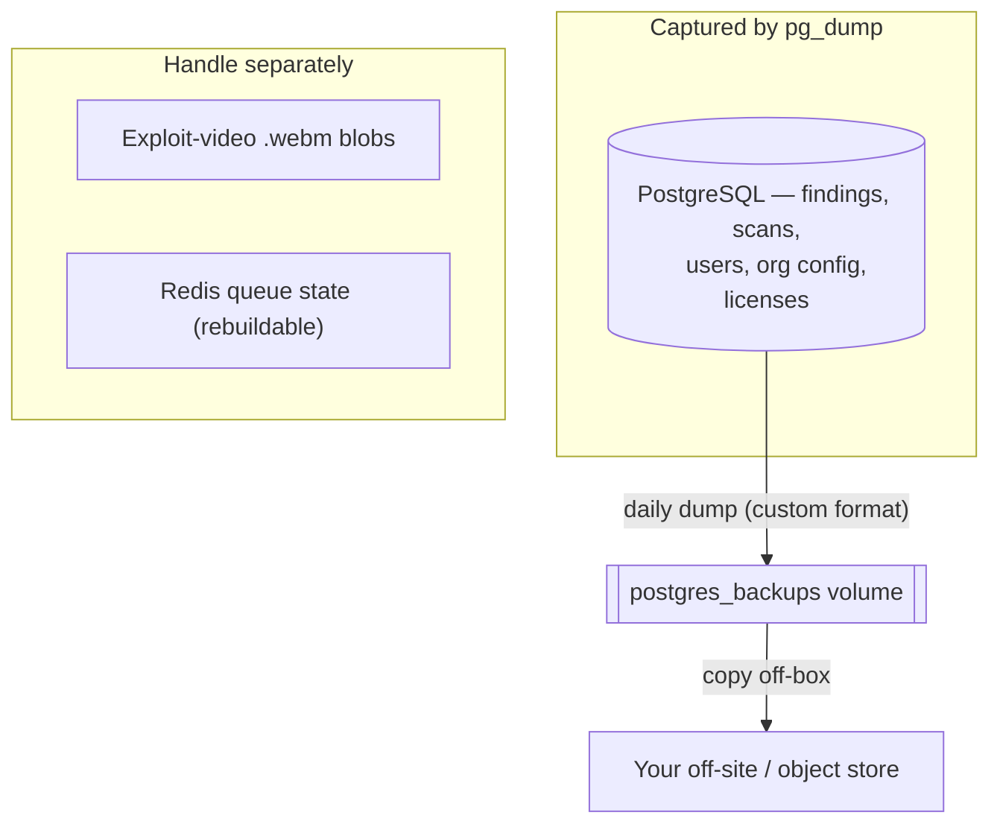

Once BreachLens is deployed and scanning, day-2 work is mostly ordinary
operations: keep the database backed up, move to a new release safely,
watch the logs, and confirm the stack is healthy. BreachLens ships a
first-class backup service and dedicated health endpoints; for everything
else it runs on the same Docker Compose or Kubernetes tooling you already
use — there's no bespoke control plane to learn.

<Note>
  BreachLens is self-hosted. **Your code, findings, and AI inference stay
  inside your network** — nothing about routine operations phones home.
  See [Offline and air-gapped installs](#offline-and-air-gapped-installs)
  for the one caveat: some scanners fetch rule and vulnerability data at
  scan time, so a fully disconnected deployment needs offline mirrors.
</Note>

## Where state lives

Almost everything worth protecting is in **PostgreSQL** — findings,
scan history, users, org config, licenses, correlation results. Back up
Postgres and you've captured the platform's state. The rest of the
persistent state lives in named Docker volumes (Compose) or the
equivalent PersistentVolumes / managed services (Kubernetes):

| Volume | Holds | Backed by the DB dump? |
|---|---|---|
| `postgres_data` | The database — the source of truth | Yes (via `pg_dump`) |
| `postgres_backups` | The daily dumps themselves | — |
| `redis_data` | Queue + session state (rebuildable) | No — ephemeral by design |
| `ollama_data` | Local LLM weights (`ai` profile) | No — re-pulled on demand |
| `prometheus_data` / `grafana_data` | Metrics + dashboards (`observability` profile) | No |

<Warning>
  **Exploit-video replays are not in the database backup.** The `.webm`
  proof clips live on a separate path (container-local by default, an
  `emptyDir` on Kubernetes), so they do not survive a container recreate
  unless you mount durable storage there and back it up yourself. The
  finding rows survive in Postgres; only the video bytes are at risk.
  Durable object-store backing for videos is on the roadmap, not shipped.
</Warning>

## Back up

### The backup service (Docker Compose)

BreachLens includes a `backup` service that runs a daily `pg_dump` on a
schedule, prunes old dumps by count, and — when you supply a key —
encrypts each dump at rest. It writes into the `postgres_backups`
volume, and the API surfaces its status in **Settings → Operations**.

<Steps>
  <Step title="Confirm it's running">
    The service comes up with the default stack and takes an initial
    backup on first boot.

    ```bash
    docker compose ps backup
    docker compose logs -f backup
    ```
  </Step>
  <Step title="Tune the schedule and retention">
    Set these in `.env` (defaults shown):

    ```bash
    BACKUP_TIME=02:00              # HH:MM UTC daily
    BACKUP_RETENTION_COUNT=14      # keep last N dumps
    BACKUP_ENCRYPTION_KEY=         # 64 hex chars = AES-256
    ```

    Generate an encryption key with `openssl rand -hex 32`. Leave it
    empty and dumps are written unencrypted.
  </Step>
  <Step title="Take an ad-hoc backup before risky changes">
    Run one immediately — do this before every upgrade:

    ```bash
    docker compose run --rm backup --once
    ```
  </Step>
</Steps>

<Tip>
  Store the encryption key somewhere **other** than the backup volume — a
  secrets manager or your password vault. An encrypted dump plus a key
  sitting next to it is the same as an unencrypted dump.
</Tip>

### What a database backup captures



The dumps are only durable if you copy them **off the host** — the
`postgres_backups` volume dies with the host it lives on. Use whatever
you already run for off-site copies (`rsync`, `restic`, `aws s3 cp`, a
mounted object store); BreachLens does not ship an off-host uploader.

### Restore

Restoring replays a dump over the live database.

```bash
docker compose run --rm backup \
  --restore /backups/breachlens-<timestamp>.dump
```

<Warning>
  **Restore is destructive.** It drops and recreates the `public` schema
  before replaying the dump — every current row is deleted. The tool
  requires you to type `RESTORE` to confirm (pass `--yes` only in
  automation). Restore into a fresh or throwaway database first when you
  just need to inspect a dump. After a restore, run
  `docker compose restart api`.
</Warning>

<Warning>
  Never recover by resetting the schema by hand — `prisma db push
  --force-reset`, `prisma migrate reset`, and `DROP SCHEMA` all wipe every
  row. Use the restore path above, which is built to replay a known-good
  dump, not to improvise against a live database.
</Warning>

### Kubernetes and managed Postgres

On Kubernetes, BreachLens typically points at a **managed PostgreSQL**
(the `DATABASE_URL` in the `breachlens-secrets` bundle). The Kubernetes
manifests do **not** ship a backup CronJob — backups are your database
provider's job:

- **Managed Postgres** (DigitalOcean, RDS, Cloud SQL, …) — enable the
  provider's automated backups and point-in-time recovery. This is the
  recommended path.
- **Self-run Postgres in-cluster** — schedule your own `pg_dump`
  `CronJob`, or run the Compose `backup` container against the same
  `DATABASE_URL`. Use your **standard Postgres backup tooling** here;
  there is no BreachLens-specific requirement beyond "it's a normal
  PostgreSQL database."

## Upgrade

BreachLens is delivered as **versioned container images** (API, web,
scanner tiers, migrate). Upgrading means pointing your deployment at a
newer image version; schema migrations then apply themselves before the
API starts.

<Tip>
  Take a fresh backup first — `docker compose run --rm backup --once`, or
  a provider snapshot on managed Postgres. Two minutes now saves an
  afternoon later.
</Tip>

<CodeGroup>
```bash Docker Compose
# Pull the release you were given, then recreate.
docker compose pull
docker compose up -d
# The one-shot `migrate` service runs first and
# gates the api until the schema is current.
```

```bash Kubernetes
# Bump the pinned image digest in your k8s/*.yaml,
# apply (or let Argo CD sync), then watch the roll.
kubectl -n breachlens apply -f k8s/
kubectl -n breachlens rollout status deploy/api
```
</CodeGroup>

### Migrations run automatically

A one-shot **migrate** step runs before the API becomes ready. On
Kubernetes it runs `prisma migrate deploy` against the checked-in,
ordered migration files — it only *applies* pending migrations, never
drops anything implicitly, and is a no-op when nothing is pending, so
re-running it on every deploy is safe.

<Note>
  If the API won't come healthy after an upgrade, check the migrate
  logs first — a failed or blocked migration is the most common cause.
  See [Logs](#logs) for where to read them.
</Note>

## Offline and air-gapped installs

BreachLens is designed to run without outbound internet for its own
operation, and it keeps your data in your network. But **"data residency"
is not the same as "fully air-gapped out of the box."** Several scanners
fetch third-party rule and vulnerability data at scan time:

- **Semgrep** (code) defaults to `--config auto`, which downloads rule
  packs.
- **Trivy** (containers / IaC) fetches its vulnerability database at scan
  time.
- **SCA reachability** resolves advisories against `api.osv.dev`.
- **Nuclei** templates, by contrast, are **baked into the scanner image**
  — no runtime fetch.

<Warning>
  A genuinely disconnected deployment requires the operator to provision
  **offline mirrors** for the rule and vulnerability data above (a local
  Semgrep rule source, a mirrored Trivy DB, an internal OSV mirror) and
  to transfer new images in through your own registry mirror or image
  bundle. Do not assume a network-isolated install scans with current
  data until those mirrors are in place.
</Warning>

## Logs

Logs are plain container stdout — read them with your normal tooling.
Scanner containers flush output live, so you can watch a scan progress
in real time.

<CodeGroup>
```bash Docker Compose
docker compose logs -f api
docker compose logs -f scanner
docker compose logs -f migrate      # after an upgrade
```

```bash Kubernetes
kubectl -n breachlens logs -f deploy/api
kubectl -n breachlens logs -f deploy/scanner
kubectl -n breachlens logs -f job/breachlens-migrate
```
</CodeGroup>

Which service to watch depends on the symptom:

| Service | Watch it for |
|---|---|
| `api` | Job orchestration, auth/SSO, queue workers, most errors |
| `scanner` / `scanner-pentest` | Live scan progress and per-tool output |
| `migrate` | Schema migrations on boot / after an upgrade |
| `postgres` / `redis` | Database or queue connectivity issues |
| `web` | Frontend serving + reverse-proxy to the API |

## Health

The API exposes two health endpoints with deliberately different depth:

- **`/health`** — a shallow, cheap liveness probe. It checks that
  PostgreSQL and Redis are reachable and returns `200` with
  `{"status":"ok"}` (or `503` `degraded`). This is what the container
  healthcheck and any load-balancer probe hit on every interval.
- **`/healthz`** — a deeper readiness probe. It verifies the database is
  *writable* (not a read replica), that Redis round-trips a write, and
  that the scanner service is reachable — each with a latency
  measurement. Use it for operator dashboards and smoke tests, not for
  per-second polling.

<CodeGroup>
```bash Docker Compose
docker compose ps                 # health column per service
curl -sf http://localhost:3000/health
curl -sf http://localhost:3000/healthz
```

```bash Kubernetes
kubectl -n breachlens get pods
kubectl -n breachlens exec deploy/api -- \
  curl -skf https://localhost:3000/healthz
```
</CodeGroup>

<Note>
  When TLS is enabled (the default in most deployments), the API serves
  HTTPS with an internal CA, so probe it as `https://…` and pass `-k` to
  accept the self-signed certificate. The in-container healthcheck and
  Kubernetes probes already handle this for you — the note matters only
  for manual `curl` from outside.
</Note>

The scanner tiers and the web frontend expose their own `/health`
endpoints too, which is how `docker compose ps` and the Kubernetes
readiness probes derive each service's status. The **Settings →
Operations** page in the UI rolls up backup status and license state for
a quick at-a-glance check without touching a shell.

## Next steps

<CardGroup cols={2}>
  <Card title="Architecture" icon="sitemap" href="/deployment/architecture">
    The services, ports, networks, and volumes these operations act on.
  </Card>
  <Card title="Continuous monitoring" icon="wave-pulse" href="/pipeline/continuous-monitoring">
    Keep scanning after deploy — event-driven, scheduled, and runtime.
  </Card>
</CardGroup>
